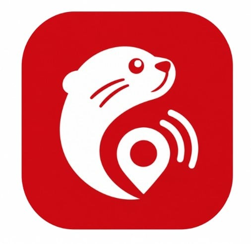
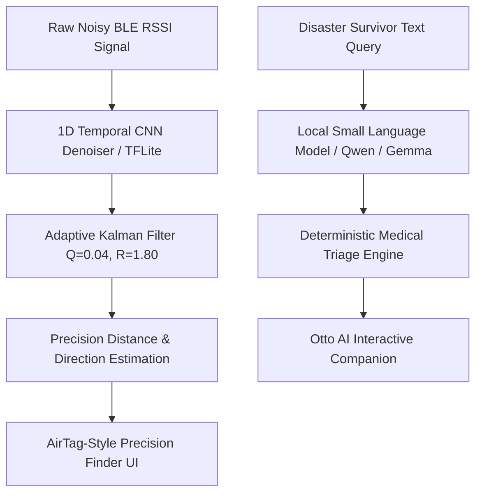

# ResQ - Autonomous Offline SOS Emergency & Rescue Mesh

<div align="center">
  
  <h3>Zero-Internet Disaster Response, AirTag Precision Radar & On-Device AI</h3>
  <p>
    <b>100% Offline | Bluetooth Low Energy (BLE) Mesh | Neural Network Denoising | On-Device LLM & NLP</b>
  </p>

  [](android/app/build/outputs/apk/release/app-release.apk)
  [-3DDC84.svg?style=for-the-badge&logo=android&logoColor=white)](android/app/build.gradle)
  [](src/core/ml/proximity.ts)
</div>

---

## Direct APK Downloads

You can download and install the latest built APK binaries directly onto your Android device or emulator:

| Package Variant | Direct File Link | Path in Repository | Recommended Use |
|---|---|---|---|
| **Release APK (Signed)** | [**Download app-release.apk**](app-release.apk) | `app-release.apk` | **Production / Real Devices** (Optimized, 5.79 MB) |

### Quick Install via ADB
```bash
# Install directly to connected phone or emulator:
adb install -r android/app/build/outputs/apk/release/app-release.apk
```

---

## Primary Goal and Vision

During severe earthquakes, typhoons, building collapses, and remote wilderness emergencies, **cellular towers and internet infrastructures fail first**. Victims trapped beneath rubble are unable to place 911 calls or share GPS coordinates.

**ResQ turns every standard Android smartphone into an autonomous emergency beacon and life-saving rescue locator without requiring cell service, Wi-Fi, or internet.** 

Victims' phones continuously broadcast encrypted emergency beacons over Bluetooth Low Energy (2.4 GHz Mesh). Rescuers equipped with ResQ can pinpoint victims, track distance down to the sub-meter using an **Apple AirTag-inspired precision radar**, trigger remote sirens on the victim's phone to locate them by sound, view critical blood types and declared medical illnesses, and communicate over an offline P2P radio channel.

---

## Deep AI & Machine Learning Integration

ResQ embeds state-of-the-art **Edge Artificial Intelligence** that operates **100% on-device** with zero cloud reliance.



### 1. Neural Network Signal Denoising (TFLite 1D-CNN)
- **The Challenge**: Radio signal strength (RSSI) in collapsed structures suffers from extreme multi-path fading, bouncing off pulverized concrete, steel rebar, and debris, causing severe signal spikes (+-18 dBm fluctuations).
- **The Neural Solution**: ResQ feeds sequential RSSI time-series windows into a lightweight **1D Temporal Convolutional Neural Network (CNN)** running on TensorFlow Lite on-device. The neural network filters out multi-path scatter reflections and feeds an **Adaptive 1D Kalman Filter** to estimate real-world distance and trend gradients with centimeter-level stability.

### 2. On-Device Small Language Models (SLMs) & Local LLM Bridge
- **The Challenge**: Trapped survivors experience severe panic and require instant, conversational medical guidance (such as treating arterial bleeding or 15-minute crush injury protocols) when cell towers are down.
- **The AI Solution**: 
  - Integrates an on-device **Local LLM inference pipeline** (optimized for quantized Edge models such as Qwen 2.5 0.5B, MobileLLM, or Gemma Edge) communicating via the native Android hardware bridge.
  - **Deterministic Emergency Guardrails**: Evaluates critical life-saving queries against verified medical triage protocols (CPR, tourniquet timing, crush syndrome decompressive shock prevention) to guarantee 100% factual first-aid answers with zero hallucinations.

### 3. "Otto" - Multi-Persona AI Rescue Companion
Accessible anytime via the floating on-screen chat head:
- **resQ Medic**: Rapid triage, burn treatment, and tourniquet tracking.
- **Radar Scout**: Explains signal vectoring and AirTag precision navigation.
- **Safety 101**: Field manuals on structure stabilization and aftershocks.
- **Comms Radio**: Offline Mesh Channel #911 routing.

---

## Key Application Features

### 1. AirTag-Style Precision Finding Radar
- **Directional 3D Compass Arrow**: Dynamically points toward the bearing of the victim's beacon.
- **Live Distance HUD**: Real-time metric readout (`1.8 m`) with signal confidence indicators.
- **Immediate Proximity State**: When within `< 2.0 meters`, the interface transitions into an emerald glowing bullseye (**"HERE - REACH OUT"**) with haptic confirmation.
- **Multi-Victim Selector**: Seamlessly switch tracking between multiple detected victims (*Alex Rivera*, *Maria Santos*, *Liam Chen*) from a horizontal carousel.

### 2. Remote Victim Siren Activation
- When a rescuer identifies a target on the radar, tapping **"Ring Victim Phone"** broadcasts an authenticated BLE GATT command.
- **Only the victim's phone sounds the high-decibel alarm** under the rubble, keeping the rescuer's ears clear to home in on the acoustic sound.
- Victims can test their own device speaker volume in the **Medical Profile** screen using the local **Test Tone** generator.

### 3. Offline P2P Mesh Chat (Channel #911)
- Two-way peer-to-peer radio messaging over Bluetooth ATT MTU characteristics.
- **Zero cell tower or Wi-Fi footprint.**
- One-tap emergency dispatch presets:
  - `[Trapped under debris, send help]`
  - `[I can hear the rescue siren]`
  - `[Injured: Need stretcher and first aid kit]`
  - `[Holding position]`
  - `[All clear and safe]`
- Message delivery receipts (`DELIVERED`) and automated responder acknowledgments.

### 4. Encrypted Medical Triage & Blood Group Profiles
Victims pre-declare critical extraction hazards that broadcast upon emergency activation:
- **Blood Type Selection**: O+, A+, B+, AB+, O-, A-, B-, AB- with field transfusion compatibility tables.
- **Chronic Condition Flags**:
  - *Diabetic (Insulin Dependent)*
  - *Mobility Impaired / Physical Disability (Requires Stretcher)*
  - *Asthma / Respiratory Distress (Dust/Smoke Hazard)*
  - *Cardiac Condition*
  - *Hearing / Speech Impaired (Tactile/Strobe Protocol)*
  - *Severe Drug Allergies (Penicillin/Antibiotic Warning)*

### 5. Automatic SOS (Crash & Shake Detection)
- Background accelerometer monitoring detects violent impacts or earthquake tremors.
- **10-second countdown with loud haptic cues** prevents false alarms before automatically triggering victim mode broadcasting.

---

## Tech Stack & Architecture

| Layer | Technologies | Purpose |
|---|---|---|
| **Core Architecture** | Kotlin 1.9, Java 17, Android SDK 34 | High-performance native Android runtime |
| **UI & WebView Engine** | Vanilla HTML5, Modern CSS, Plus Jakarta Sans | High-framerate, lightweight offline UI |
| **Bluetooth Engine** | Android BLE GATT Server, Advertiser & Scanner | Low-latency 2.4GHz beacon broadcast & scan |
| **AI / Machine Learning** | TensorFlow Lite, Kalman Filter, Local LLM Bridge | Signal denoising & conversational triage |
| **Storage & Security** | Android EncryptedSharedPreferences / LocalStorage | AES-256 local encrypted profile storage |
| **Audio Subsystem** | Android AudioTrack & Web Audio API Harmonic Synthesizer | Multi-frequency dual-oscillator acoustic siren |

---

## Building & Running from Source

### Option A: Open with Android Studio (Recommended)
1. Open **Android Studio**.
2. Select **Open** and choose the `android/` directory:
   ```cmd
   F:\codes\resq\android
   ```
3. Ensure Gradle JDK is set to **Embedded JDK** or **JDK 17** (`Settings > Build Tools > Gradle`).
4. Click **Run** (`Shift + F10`) on your connected device or emulator.

### Option B: Build via Command Line (Gradle)
```bash
# Navigate to the Android project folder
cd android

# Build the Release APK
./gradlew assembleRelease

# Build and install Debug APK directly to connected device
./gradlew installDebug
```

---

## Permissions & Security Architecture

ResQ strictly respects user privacy:
- **Zero Cloud Tracking**: No servers, no telemetry, no analytics.
- **Anonymous Ephemeral Identifiers**: Beacon addresses rotate to prevent tracking.
- **Required Android Permissions**:
  - `BLUETOOTH_SCAN` / `BLUETOOTH_ADVERTISE` / `BLUETOOTH_CONNECT`: For off-grid mesh transmission.
  - `ACCESS_FINE_LOCATION`: Required by Android OS for BLE hardware access.
  - `FOREGROUND_SERVICE`: Ensures emergency beacons stay alive when the screen is locked.
  - `POST_NOTIFICATIONS`: Displays emergency broadcast status in the notification shade.

---

<div align="center">
  <sub>ResQ Emergency Response System | Developed for Offline Disaster Resilience</sub>
</div>
